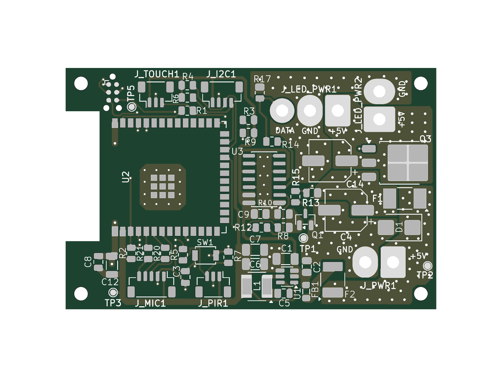
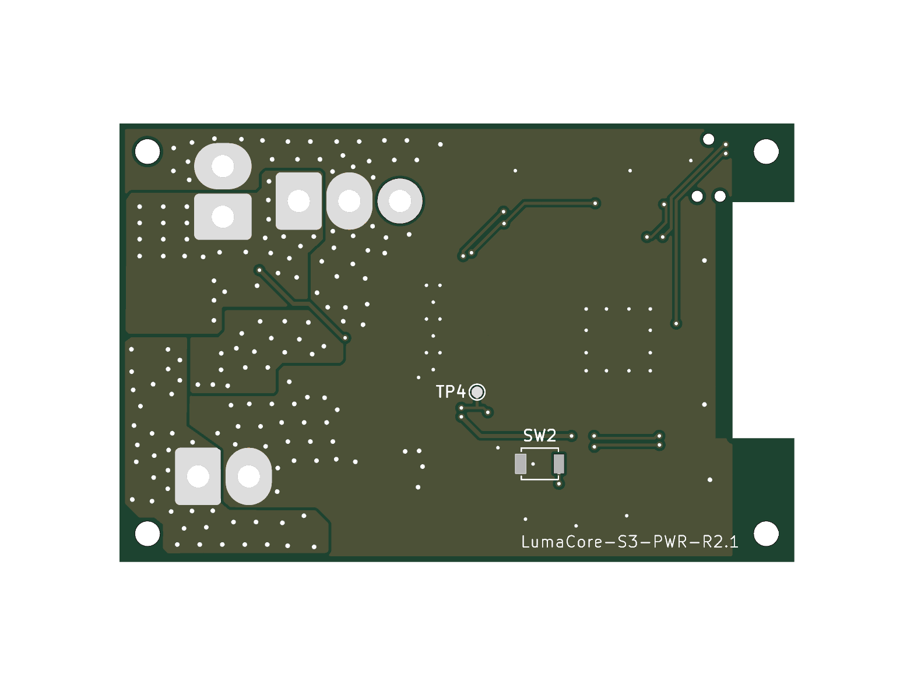

# PCB — LumaCore-S3-PWR

Электроника Fire Lamp построена на контроллере LumaCore-S3-PWR.

## Рендеры платы

### Верхняя сторона

### Нижняя сторона

## Исходники

В каталоге `source/` находятся исходники KiCad:

- проект;
- принципиальная схема;
- печатная плата.

В каталоге `production/` размещены открытые производственные данные, которые можно использовать для анализа платы и подготовки сборки.

## Основные параметры

- MCU: ESP32-S3-WROOM-1;
- питание изделия: 5 В;
- нагрузка: WS2812B 16×16;
- LED DATA: отдельный буферизированный цифровой выход;
- управление питанием LED;
- отдельное питание логики 3,3 В.

## Ревизия

Опубликованный набор PCB основан на LumaCore-S3-PWR R2.1.

Плата является частью проекта Fire Lamp, но может использоваться и как самостоятельная аппаратная платформа.
